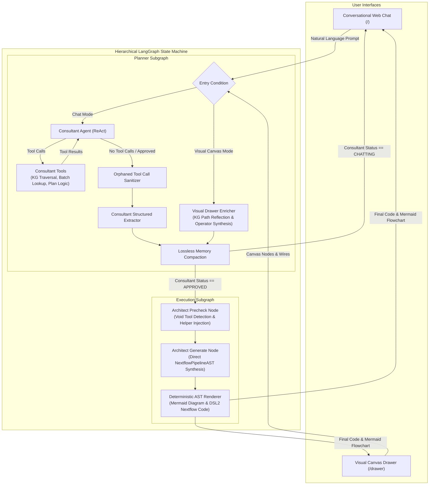

# Cohesive LLM — AI-Driven Nextflow DSL2 Pipeline Synthesis Platform

[](#)
[](LICENSE)
[](https://www.python.org/)
[](https://fastapi.tiangolo.com/)
[](https://langchain-ai.github.io/langgraph/)
[](https://docs.pydantic.dev/)
[](https://docs.docker.com/compose/)

A self-hostable, production-grade AI platform that transforms natural language biological inquiries or visual drag-and-drop workflow canvas diagrams into valid, fully executable, and deterministic Nextflow DSL2 pipelines targeting production bioinformatic frameworks (e.g. [cohesive-ngsmanager](https://github.com/genpat-it/cohesive-ngsmanager)).

---

## 1. System Overview & Key Capabilities

Cohesive LLM eliminates the trial-and-error manual scripting of complex bioinformatics pipelines by combining an **Abstract Syntax Tree (AST) Generation Engine**, a **Topological Knowledge Graph**, and a **Dual-Mode LangGraph State Machine**.

### Key Architectural Capabilities:

- **Dual Interaction Interfaces**:
  - **Conversational Chat**: Interactive multi-turn consultation with conversational approval detection, plan formulation, and real-time streaming SSE output.
  - **Visual Canvas Drawer (`/drawer`)**: Interactive drag-and-drop node-wire canvas. Users place modules and connect wires; the backend hydrates component schemas from the Knowledge Graph and automatically synthesizes required Nextflow DSL2 operators (`.cross()`, `.map{}`, `.multiMap{}`, `.combine()`, `param()`).
- **100% Plugin-Agnostic Core Invariant**:
  - The core reasoning engine (`backend/core/`) contains **zero hardcoded tool names, organism types, or domain-specific logic**. All components, input/output channels, void tool rules, and parameter signatures are loaded dynamically at runtime through plugin catalogs (`backend/plugins/<plugin_name>/`).
- **Topological Knowledge Graph (`kg`)**:
  - A Graphify-powered knowledge graph indexing all components, templates, and dataflow connections across 3 confidence tiers:
    - `EXTRACTED`: Real, verified AST wiring from existing production Nextflow DSL2 pipelines.
    - `INFERRED`: Co-occurrence patterns extracted from pipeline templates.
    - `AMBIGUOUS`: Heuristic channel-name semantic matches.
  - Supports BFS broad exploration, DFS linear chain tracing, community clustering, and god-node hub discovery.
- **Deterministic AST Compilation & Zero-Repair Generation**:
  - The LLM acts solely as a high-level AST architect, outputting a strictly typed Pydantic `NextflowPipelineAST` object.
  - A deterministic AST compiler converts the AST directly into valid Nextflow DSL2 code and Mermaid architecture flowcharts with **0 reliance on brittle error-repair loops**.
- **Lossless Memory Compaction & 16k Generation Headroom**:
  - Optimized for long-context reasoning models (`Qwen/Qwen3.8-27B-FP8`) with 65k context window and 16,384 maximum completion tokens.
  - Multi-turn tool execution facts are losslessly compacted into structured `tool_memory` without losing verified component properties across long chat sessions.

---

## 2. Architecture & StateGraph Topology

The execution workflow is orchestrated as a hierarchical LangGraph state machine partitioned into a **Planner Subgraph** and an **Execution Subgraph**:



---

## 3. Repository Layout

```
cohesive-llm/
├── backend/                         FastAPI backend, LangGraph engine, and test suites
│   ├── app/                         Application layer (FastAPI, SQLite, Auth, Routes)
│   │   ├── models/                  Database schemas & authentication models
│   │   ├── routes/                  HTTP & SSE streaming route handlers
│   │   ├── services/                Auth token management & rate limiters
│   │   └── api.py                   FastAPI entrypoint and endpoint registration
│   ├── core/                        100% Plugin-Agnostic Reasoning Engine
│   │   ├── adapters/                LLM provider and vector store adapters
│   │   ├── models/                  Pydantic AST structures and structured outputs
│   │   ├── nodes/                   LangGraph executable agent nodes (Architect, Consultant, Drawer Enricher)
│   │   ├── prompts/                 Base prompt templates and dynamic overlay builders
│   │   ├── services/                StateGraph, Knowledge Graph, AST Compiler, Deterministic Renderer
│   │   ├── utils/                   Structured logging and exponential backoff retries
│   │   ├── catalog_registry.py      Dynamic catalog and void-tool registry
│   │   ├── config.py                Pydantic settings and environment management
│   │   ├── loader.py                DataLoader for FAISS, catalogs, and knowledge graphs
│   │   └── plugin_loader.py         Plugin discovery, loading, and validation
│   ├── plugins/                     Domain plugins containing bioinformatics catalogs
│   │   ├── izs/                     IZS Bioinformatics domain plugin (components, FAISS index, templates)
│   │   └── synthetic/               Minimal test plugin for benchmark & CI tests
│   ├── tests/                       Unit tests, competency batteries, and pairwise evaluation harness
│   │   ├── unit/                    Fast offline unit tests (33 tests, ~0.5s execution)
│   │   ├── evaluation/              LLM-as-a-judge pairwise evaluation battery
│   │   └── run_unit_tests.py        Standard offline test runner
│   ├── Dockerfile                   Production backend container image definition
│   └── main.py                      Backend application server bootstrap
├── frontend/                        Modern vanilla HTML5/CSS3/ES6 web interface
│   ├── index.html                   Conversational chat interface with markdown table & code highlighting
│   ├── drawer.html                  Visual drag-and-drop Drawflow pipeline designer
│   ├── login.html                   Authentication & session sign-in interface
│   ├── css/ & style.css             Modular design system, glassmorphism, and responsive styling
│   └── js/                          ES6 frontend modules (chat, drawer, api, sidebar, modal)
├── caddy/                           Caddy reverse proxy configuration and static file server
├── deploy/                          Deployment configurations and service definitions
├── docker-compose.yml               Complete multi-container production orchestration
└── README.md                        Top-level platform documentation
```

---

## 4. Quickstart & Local Setup

### Prerequisites
- Python 3.11 or 3.12
- Local vLLM instance or OpenAI-compatible LLM endpoint (e.g. `Qwen/Qwen3.8-27B-FP8`)
- Node.js (optional, for frontend asset tooling)

### Step 1: Clone the Repository
```bash
git clone https://github.com/genpat-it/cohesive-llm.git
cd cohesive-llm
```

### Step 2: Set Up Virtual Environment & Dependencies
```bash
python3 -m venv venv
source venv/bin/activate
pip install -r backend/requirements.txt
```

### Step 3: Configure Environment Variables
Create a `.env` file in the project root:
```ini
# LLM Endpoint Configuration
LLM_PROVIDER=openai
LLM_MODEL=Qwen/Qwen3.8-27B-FP8
LOCAL_LLM_URL=http://localhost:8000/v1
OPENAI_API_KEY=dummy-key

# Memory & Context Settings
MEMORY_KEEP_LAST_N=60
MAX_COMPLETION_TOKENS=16384

# Active Plugin
ACTIVE_PLUGIN=izs
```

### Step 4: Run the Backend Server
```bash
PYTHONPATH=backend python3 backend/main.py
```
The server will start at `http://localhost:8080`.

### Step 5: Access the Interfaces
- **Chat Interface**: Navigate to `http://localhost:8080`
- **Visual Canvas Drawer**: Navigate to `http://localhost:8080/drawer`
- **System Telemetry**: Check health and token metrics at `http://localhost:8080/system-info`

---

## 5. Running Automated Verification & Tests

The test suite is divided into fast, offline unit/competency tests and live LLM evaluation benchmarks:

```bash
# Run all offline unit tests (33 tests, ~0.5s execution)
PYTHONPATH=backend python3 backend/tests/run_unit_tests.py

# Update the graphify knowledge graph after code modifications
graphify update .
```

---

## 6. Credits & Collaboration

This platform was developed as a thesis research project by three students of the **Erasmus Mundus Joint Master Degree Programme on the Engineering of Data-intensive Intelligent Software Systems (EDISS)**, carried out in collaboration with the **Istituto Zooprofilattico Sperimentale dell'Abruzzo e del Molise "G. Caporale" (IZS Teramo)**:
- **Martinus Grady** — Lead Architecture & Agent Engineering ([@mgradyn](https://github.com/mgradyn))
- **Ligan Cai** — Co-Author & Evaluation ([@Tsailgan](https://github.com/Tsailgan))
- **Zeynal Mardanli** — Co-Author & Frontend ([@Lshiroc](https://github.com/Lshiroc))
