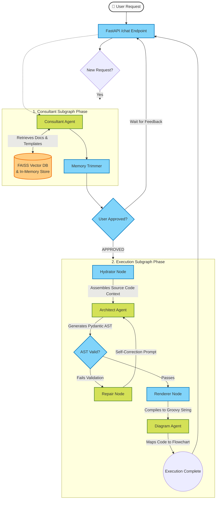

# Nextflow AI Agent API (`izs-llm`) - Comprehensive Documentation

Welcome to the **IZS Nextflow AI Agent API** (`izs-llm`). This repository contains an intelligent, multi-agent AI backend built with **FastAPI** and **LangGraph** designed to consult, architect, and generate production-ready Nextflow DSL2 pipelines on demand. 

This document serves as the exhaustive "per-folder, per-file" guide to the repository's internals, alongside architectural diagrams explaining how the system operates.

---

## 🏗️ System Architecture & Agent Workflow

The core of the system is a two-phase cyclic state machine powered by **LangGraph**. It is divided into a **Planner Subgraph** (for user interaction and RAG retrieval) and an **Execution Subgraph** (for code generation, repair, and diagram compilation).



---

## 📂 Directory & File Index

Below is the exhaustive file-by-file breakdown of the repository.

### 📁 Root Directory

| File / Folder | Purpose / Description |
|---|---|
| `main.py` | The main Uvicorn entrypoint script. Reads the `PORT` environment variable and launches the FastAPI application from `app.api`. |
| `Dockerfile` | Defines the lightweight Linux container for the API. Uses Python 3.12-slim. Configures the environment for compatibility with restricted container platforms by forcing group ownership (`chgrp -R 0`) and setting the `HF_HOME` to `/tmp`. |
| `docker-compose.yml` | Local orchestration file. It builds the `api` service and links it to a `caddy` service to automatically serve the application over HTTP/HTTPS locally. |
| `Caddyfile` | Configuration for the Caddy web server acting as a reverse proxy for the API. |
| `requirements.txt` | Python dependency lockfile. Includes `fastapi`, `langgraph`, `langchain-mistralai` (or other LLMs), `pydantic`, `faiss-cpu`, and `sentence-transformers`. |
| `langgraph.json` | Configuration file that defines the location of the graph (`app.services.graph:app_graph`) for use with LangGraph Studio or CLI testing. |
| `test_graph.py` | A CLI testing script used to test the graph logic directly in the terminal without spinning up the FastAPI server. |
| `test_consultant_rag.py` | A unit test script specifically for testing the Consultant Agent's RAG retrieval accuracy and graph traversal. |

---

### 📁 `app/` Directory (Core Logic)

This folder contains the python backend application logic.

#### 📄 `app/api.py`
The FastAPI application definition. 
- Defines the `ChatRequest` and `ChatResponse` Pydantic models.
- Uses a `@asynccontextmanager` lifespan to trigger `data_loader.load_all()` to boot up FAISS and the in-memory store before serving requests.
- Exposes `GET /health` and `POST /chat`. The `/chat` endpoint interacts directly with the compiled LangGraph object.

#### 📁 `app/core/` (Configurations & Loaders)
- **`config.py`**: A centralized settings class defining all absolute path names for the vector store, code JSONs, and catalog components, ensuring no paths are hardcoded.
- **`loader.py`**: Defines the `DataLoader` class. On application startup, this reads `.json` and `.jsonl` files from `data/catalog/` and spins up the FAISS index (`HuggingFaceEmbeddings`) for semantic RAG search.

---

#### 📁 `app/models/` (Data Structures & Validation)
Strict Pydantic typing used by the standard API and LangChain structured outputs (`with_structured_output`). These act as the Guardrails for the Agents.

- **`consultant_structure.py`**: Defines `ConsultantOutput`. Forces the Consultant LLM to return a `response_to_user`, a `status` (CHATTING or APPROVED), a `draft_plan`, and strict extracted arrays for `selected_module_ids` and `used_template_id`.
- **`ast_structure.py`**: The most critical and complex file in the system. Defines the Abstract Syntax Tree schema (e.g., `NextflowPipelineAST`, `WorkflowBlock`, `InlineProcess`, `GlobalDef`). It contains dozens of `@field_validator` and `@model_validator` functions that actively analyze the Groovy code synthesized by the Architect LLM to block Nextflow hallucinations (e.g., preventing Void tool assignment, enforcing `.multiMap` structures, checking scope).
- **`diagram_structure.py`**: Defines `DiagramData` featuring `Node` and `Edge` arrays. It enforces valid Mermaid syntax (e.g., preventing reserved keywords / floating nodes) for the Diagram Agent.

---

#### 📁 `app/services/` (Agents, Tools & Graphs)
The brains of the operation. This hooks everything together.

- **`graph_state.py`**: Defines the `GraphState` `TypedDict` utilized by LangGraph to pass contextual data around the nodes (e.g., `messages`, `ast_json`, `mermaid_code`, `nextflow_code`).
- **`graph.py`**: Contains the visual node map (defined in code using `StateGraph`). Defines the `build_consultant_subgraph` and `build_execution_subgraph`, adding the conditional edges controlling logic flow between the Consultant, Hydrator, Architect, and Renderer.
- **`agents.py`**: Contains the actual LLM wrappers and **System Prompts**.
  - `consultant_node`: Merges the user request with RAG data to chat with the user.
  - `hydrator_node`: An algorithmic (non-LLM) node that evaluates the Consultant's `strategy_selector` (Exact Match, Adapted Match, Custom) and assembles the raw `code_store_hollow.jsonl` Groovy string into context for the Architect.
  - `architect_node`: Instructed by massive system prompts dictating internal Nextflow DSL idioms, translating the Consultant's `draft_plan` into the `NextflowPipelineAST`.
  - `diagram_node`: Tells an LLM to read the final Groovy code and create nodes/edges.
- **`llm.py`**: A factory function (`get_llm()`) that parses the configured `settings.LLM_MODEL` to return the appropriate LangChain Chat Model initialization (e.g., ChatHuggingFace vs ChatMistralAI).
- **`tools.py`**: Contains the `retrieve_rag_context()` function. This handles **Hybrid Search**: first scanning metadata json via keyword matches, and supplementing it via FAISS semantic search. Used heavily by the Consultant.
- **`repair.py`**: The error handling loop. If `ast_structure.py` throws a Python Validation Error, the `repair_node` wraps that exact error in a strict prompt ("YOU ARE DRIFTING FROM THE SCHEMA... FIX IT") and routes back to the Architect node.
- **`renderer.py`**: Contains the `renderer_node` which extracts the generated AST JSON and passes it to Jinja2 to render the final `main.nf` script. Contains `render_mermaid_from_json()` to parse diagram state.

#### 📁 `app/utils/`
- **`rendering.py`**: Contains the `NF_TEMPLATE_AST` variable, a gigantic Jinja2 string template mapping the AST JSON properties (`imports`, `globals`, `sub_workflows`, `entrypoint`) into beautifully spaced Groovy code.

---

### 📁 `data/` Directory (RAG Knowledge Base)

The data source for truth in the agentic system.

- **`faiss_index/`**: Auto-generated by `FAISS` running locally using `sentence-transformers`. Stores the vector embeddings utilized by the `loader.py`.
- **`code_store_hollow.jsonl`**: A JSON Lines file containing the actual stringified source code (`.nf` contents) mapped to the specific ID of standard components/templates. The Hydrator grabs code from here.
- **`catalog/`**:
  - `catalog_part1_components.json`: Metadata for standalone Nextflow steps (Tools, Inputs, Outputs).
  - `catalog_part2_templates.json`: Metadata defining predefined graph structures/blueprints (e.g., standard mapping+assembly pipelines).
  - `catalog_part3_resources.json`: Definitions of helper Groovy functions (`extractKey()`, `groupTuple`, etc.) available in the environment to prevent LLM hallucination of Nextflow features.

---

## Changes from base branch

### Anti-Hallucination System
- **AST Pydantic validators**: sub-workflow names with `module_` prefix are validated against the real framework filesystem. Invented names are blocked and trigger the repair loop with actionable error messages.
- **Framework component validator**: all `step_*`/`module_*` references in generated code are checked against the `.nf` files in `NGSMANAGER_DIR`. If a component doesn't exist, the pipeline is rejected before rendering.
- **Architect prompt rewrite**: explicit rules against single-process wrappers and invented `module_` names. Custom sub-workflows must use `wf_` prefix.

### Catalog & RAG Improvements
- **Regenerated catalog with input arity**: `generate_catalog.py` now extracts `input_channels` from every step's `take:` block. The whitelist and RAG context show `takes: assembly, genus_species` so the LLM knows how many arguments to pass.
- **RAG noise reduction**: tighter FAISS thresholds (`k=10`, `max_L2=1.2`, `margin=0.25`), keyword component cap reduced from 15 to 8, excluded debug/test templates (`module_variant_lineage_FIXED`, `_MINIMAL`, etc.).
- **Centralized RAG tuning**: all retrieval parameters extracted to `app/core/config.py` — one file to adjust thresholds without touching retrieval logic.

### Deterministic Mermaid Diagrams
- Replaced LLM-based diagram generation with a deterministic renderer from the AST JSON
- `render_mermaid_from_ast()` parses sub-workflows, entrypoint, globals, and tracks data flow
- Same pipeline always produces identical Mermaid output (no more random variation)
- Saves one LLM API call per request

### Consultant Improvements
- **Approval detection**: consultant prompt updated to recognize approval phrases ("yes", "ok", "proceed", etc.) and set APPROVED immediately instead of asking follow-up questions.

### Configuration & DevOps
- **Environment-based config**: `NGSMANAGER_DIR` and `MISTRAL_API_KEY` via `.env` / env vars. No hardcoded user paths in codebase.
- **`.env.example`**: template for required environment variables.
- **`main.py` loads `.env`** automatically via `python-dotenv`.
- **`.gitignore` cleanup**: added `__pycache__/`, `.DS_Store`, generated reports, Nextflow work dirs.

### Testing & Validation
- **`test_e2e.py`**: end-to-end test script that prompts the LLM and validates generated Nextflow code against the real framework with `nextflow run -preview`. Distinguishes code errors from missing-data errors.
- **`test_e2e_params.config`**: Nextflow config with dummy params for all framework tools, enabling `-preview` validation without real data.
- **Improved `evaluate_llm.py`**: better auto-approve message for consistent test results.

### Validation Results (E2E)
- **12/13 scenarios pass (92%)**
- **0 hallucinations** across all tests
- **4/4 negative tests correctly rejected** (BWA, Canu, Pangolin on bacteria, de novo with iVar)

---

## Setup

### Prerequisites

- Python 3.11+
- Nextflow 23+ (for pipeline validation)
- [cohesive-ngsmanager](https://github.com/genpat-it/cohesive-ngsmanager) cloned as a sibling directory

### Installation

```bash
git clone <this-repo> izs-llm
cd izs-llm
python -m venv venv
source venv/bin/activate
pip install -r requirements.txt
```

### Configuration

Copy the example env and fill in your values:

```bash
cp .env.example .env
```

`.env` contents:
```
MISTRAL_API_KEY=your_mistral_api_key
NGSMANAGER_DIR=/path/to/cohesive-ngsmanager-cli/cohesive-ngsmanager
```

The `NGSMANAGER_DIR` defaults to `../cohesive-ngsmanager-cli/cohesive-ngsmanager` (sibling directory).

### Catalog Sync

When the framework changes, regenerate the catalog:

```bash
python generate_catalog.py
python rebuild_faiss_index.py
```

This parses all steps/modules/helpers from the framework and rebuilds the RAG knowledge base.

### Run the Server

```bash
python main.py
```

The API starts on `http://localhost:8080`. Health check: `GET /health`.

### Docker

```bash
docker compose up --build
```

---

## Testing & Validation

### Unit Evaluation (`evaluate_llm.py`)

Tests the LLM on 13 scenarios (L1-L4) checking component selection, syntax, and rejection of impossible requests:

```bash
python evaluate_llm.py --output report.md
python evaluate_llm.py --levels 3 4          # Only complex + negative tests
```

### End-to-End Validation (`test_e2e.py`)

Full pipeline: prompt -> LLM generates code -> Nextflow validates it against the real framework:

```bash
python test_e2e.py --output e2e_report.md
python test_e2e.py --levels 1 2              # Only simple + medium
python test_e2e.py --prompt "I want to trim reads with fastp"  # Custom prompt
```

Requires `NGSMANAGER_DIR` to be set and Nextflow installed.

### Pipeline Syntax Validation (`validate_pipeline.py`)

Validate a single pipeline file or prompt:

```bash
python validate_pipeline.py --file my_pipeline.nf
python validate_pipeline.py --prompt "I want to do MLST" --verbose
python validate_pipeline.py --file my_pipeline.nf --stub  # Stub run
```

---

## RAG Tuning

All retrieval parameters are in `app/core/config.py`:

| Parameter | Default | Description |
|-----------|---------|-------------|
| `RAG_MAX_KEYWORD_COMPONENTS` | 8 | Max components from keyword scan |
| `RAG_MAX_KEYWORD_TEMPLATES` | 2 | Max templates from keyword scan |
| `RAG_FAISS_K` | 10 | FAISS nearest neighbors |
| `RAG_FAISS_MAX_L2_DISTANCE` | 1.2 | Max absolute L2 distance |
| `RAG_FAISS_RELATIVE_MARGIN` | 0.25 | Max distance above best match |
| `RAG_EXCLUDED_TEMPLATES` | (set) | Debug/test templates to skip |

---

## 🛠️ Usage Flow

1. **User asks:** *"I want to do viral host depletion using bowtie, then assembly."*
2. **Consultant API:** Hits `/chat`. The system spins up the Planner Graph.
3. **RAG Tool:** Grabs metadata for `bowtie`, `spades`, and an existing depletion template.
4. **Consultant AI:** *"Great, I'll use Bowtie and SPAdes. Does that work?"* (Status: `CHATTING`).
5. --- User explicitly says "Yes, looks good" ---
6. **Consultant AI:** Switches Status to `APPROVED`. Spits out `selected_module_ids=[...]`.
7. **Graph Switch:** Planner finishes. Execution Subgraph triggers automatically.
8. **Hydrator Node:** Pulls the actual `.nf` strings from the JSONL for Bowtie and SPAdes.
9. **Architect AI:** Synthesizes the final pipeline into JSON AST format via strict Pydantic rules.
10. **Renderer Node:** Turns JSON into `.nf`. Diagram turns `.nf` into Mermaid graph.
11. **API Returns:** A payload containing the finished code and Mermaid diagram!
