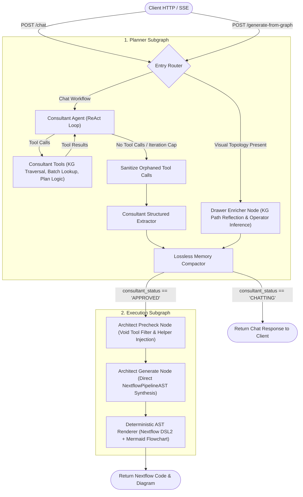

# Backend Engine Architecture & Internal Guide

The **Backend Engine** is a high-throughput, multi-agent AI backend powered by **FastAPI** and **LangGraph**. It synthesizes valid, fully tested Nextflow DSL2 pipelines from either natural language consultations or visual canvas designs (`/drawer`).

This document details the backend execution lifecycle, StateGraph topology, dynamic catalog reflection, Knowledge Graph indexing, and API surface.

---

## 1. Execution Lifecycle & StateGraph Topology

The backend execution lifecycle is managed by a hierarchical LangGraph state machine partitioned into two subgraphs: the **Planner Subgraph** (for intent classification, tool reflection, and visual graph enrichment) and the **Execution Subgraph** (for AST prechecking, direct code synthesis, and deterministic Mermaid rendering).


```mermaid
flowchart TD
    subgraph Planner ["1. Planner Subgraph"]
        EntryRoute{"Entry Router"}
        ConsultantNode["Consultant Agent (ReAct Loop)"]
        ConsultantTools["Consultant Tools (KG Traversal, Batch Lookup, Plan Logic)"]
        DrawerEnrichNode["Drawer Enricher Node (KG Path Reflection & Operator Inference)"]
        SanitizeNode["Sanitize Orphaned Tool Calls"]
        ExtractNode["Consultant Structured Extractor"]
        CompactNode["Lossless Memory Compactor"]
    end

    subgraph Execution ["2. Execution Subgraph"]
        PrecheckNode["Architect Precheck Node (Void Tool Filter & Helper Injection)"]
        GenerateNode["Architect Generate Node (Direct NextflowPipelineAST Synthesis)"]
        RendererNode["Deterministic AST Renderer (Nextflow DSL2 + Mermaid Flowchart)"]
    end

    Client([Client HTTP / SSE]) -->|POST /chat| EntryRoute
    Client -->|POST /generate-from-graph| EntryRoute

    EntryRoute -->|Chat Workflow| ConsultantNode
    EntryRoute -->|Visual Topology Present| DrawerEnrichNode

    ConsultantNode -->|Tool Calls| ConsultantTools
    ConsultantTools -->|Tool Results| ConsultantNode
    ConsultantNode -->|No Tool Calls / Iteration Cap| SanitizeNode
    SanitizeNode --> ExtractNode
    ExtractNode --> CompactNode

    DrawerEnrichNode --> CompactNode

    CompactNode -->|consultant_status == 'APPROVED'| PrecheckNode
    CompactNode -->|consultant_status == 'CHATTING'| EndPlanner([Return Chat Response to Client])

    PrecheckNode --> GenerateNode
    GenerateNode --> RendererNode
    RendererNode --> EndExec([Return Nextflow Code & Diagram])
```

---

## 2. Core Reasoning Nodes

### 1. `consultant_node` (`backend/core/nodes/consultant.py`)
- **Role**: Conversational bioinformatics specialist.
- **Operation**: Operates inside a dynamic ReAct tool-calling loop using `CONSULTANT_TOOLS`.
- **Key Features**:
  - Automatically queries the topological Knowledge Graph (`query_knowledge_graph`).
  - Batch-resolves component signatures and source code (`lookup_components_batch`).
  - Performs logical cross-check of proposed component chains (`check_plan_logic`).
  - Evaluates conversational user approval (`_detect_approval`) without relying on hardcoded tool strings.
  - Compresses conversation sliding context under `MEMORY_KEEP_LAST_N = 60` and cleans duplicate revision headers to prevent token overflow.

### 2. `drawer_enrich_node` (`backend/core/nodes/drawer_enricher.py`)
- **Role**: Visual Canvas pipeline bridge & operator synthesizer.
- **Operation**: When a user creates a pipeline visually on `/drawer`, the raw nodes and port wires are passed to this node.
- **Key Features**:
  - Dynamically queries the Knowledge Graph (`kg.G.nodes`) and component database for each placed component to retrieve takes, emits, and argument counts.
  - Resolves multi-hop AST dataflow paths between connected components (`kg.find_path(src, tgt)`).
  - Automatically infers and injects required Nextflow DSL2 channel operators:
    - **Multi-Argument / Reference Injection**: Injects `param('reference')`, `param('index')`, or `.combine()`.
    - **Keyed Stream Matching**: Injects `.cross()`, `.join()`, or `.multiMap{}` before pairing sample streams.
    - **Cohort Aggregation**: Injects `.collect()` or `.toList()` before clustering or multi-sample summary tools.
    - **Tuple Reshaping**: Injects `.map { meta, reads -> ... }` closures to reconcile arities.
    - **Exact Named Emits**: Resolves real emit channel names (e.g. `process.out.depleted_reads`).
  - Directly sets `consultant_status = "APPROVED"` to route immediately into the execution subgraph.

### 3. `architect_precheck_node` (`backend/core/nodes/architect.py`)
- **Role**: Algorithmic technical context assembler and constraint builder.
- **Operation**: Runs deterministically before AST generation.
- **Key Features**:
  - **Void Tool Detection**: Automatically identifies tools that produce no output channels (e.g. reports, publishDir endpoints) and instructs the AST architect not to assign their output variables.
  - **Template Base Injection**: Pulls verified template code from the active plugin catalog when adapting existing templates.
  - **Helper Function Discovery**: Identifies unmet channel takes across the pipeline and dynamically scores/injects relevant input retrieval helpers (e.g. `getSingleInput()`, `getReference()`).
  - **Knowledge Graph Wireframe Injection**: Injects verified dataflow path constraints directly into `technical_context`.

### 4. `architect_generate_node` (`backend/core/nodes/architect.py`)
- **Role**: Pydantic AST Synthesizer.
- **Operation**: Calls the LLM using `with_structured_output(NextflowPipelineAST)` to generate the complete pipeline Abstract Syntax Tree.
- **Key Features**:
  - Focuses strictly on logical pipeline structure: subworkflows, take/emit declarations, process invocations, channel transformations, and main entrypoint.
  - Enforces 0 repair loops — the structured AST format eliminates Nextflow syntax compilation errors by construction.

### 5. `renderer_node` (`backend/core/services/renderer.py`)
- **Role**: Deterministic AST-to-Code and AST-to-Mermaid compiler.
- **Operation**: Traverses the `NextflowPipelineAST` object to emit:
  1. Production Nextflow DSL2 `.nf` source code with correct includes, subworkflows, channel operators, and entrypoint blocks.
  2. High-fidelity Mermaid flowchart diagram accurately depicting subworkflow boundaries, take/emit ports, and dataflow connections with zero phantom or floating boxes.

---

## 3. Directory Layout & Module Overview

```
backend/
├── app/                             Application layer (FastAPI server, SQLite DB, Auth, Routes)
│   ├── models/                      SQLAlchemy database models and auth schemas
│   ├── routes/                      FastAPI route controllers (chat, auth, conversations, drawings)
│   ├── services/                    Application services (JWT tokens, password hashing, rate limiters)
│   ├── api.py                       FastAPI route registration and startup lifecycle
│   └── db.py                        SQLite database engine and session management
├── core/                            100% Plugin-Agnostic Nextflow Generation Engine
│   ├── adapters/                    LLM provider (OpenAI/vLLM) and Vector Store (FAISS) adapters
│   ├── models/                      Pydantic data models (NextflowPipelineAST, ConsultantOutput, GraphState)
│   ├── nodes/                       Executable LangGraph agent nodes (Consultant, Drawer Enricher, Architect)
│   ├── prompts/                     Prompt templates (consultant_base.md, drawer_enricher_base.md, architect.md)
│   ├── services/                    Engine services (graph.py, knowledge_graph.py, ast_compiler.py, renderer.py)
│   ├── utils/                       Structured JSON logging, retry helpers
│   ├── catalog_registry.py          Central registry for component takes, emits, void tools, and exports
│   ├── config.py                    Application settings and configuration parameters
│   ├── loader.py                    Central DataLoader booting FAISS, Knowledge Graph, and component store
│   └── plugin_loader.py             Dynamic domain plugin loader and validator
├── plugins/                         Domain-specific bioinformatics catalogs
│   ├── izs/                         Production IZS bioinformatics plugin (components, FAISS index, templates)
│   └── synthetic/                   Minimal plugin for continuous integration testing
├── tests/                           Comprehensive unit and evaluation test suite
│   ├── unit/                        Offline unit tests (33 tests covering topology, AST, error patterns, Mermaid)
│   ├── evaluation/                  Pairwise LLM evaluation battery with Glicko-2 ratings
│   └── run_unit_tests.py            Offline test runner script
├── Dockerfile                       Production Docker container recipe
├── main.py                          FastAPI application bootstrap script
└── requirements.txt                 Python package dependencies
```

---

## 4. API Surface & Endpoints

| Method | Endpoint | Description |
|---|---|---|
| `POST` | `/chat` | Conversational multi-turn chat endpoint with Server-Sent Events (SSE) streaming updates. |
| `POST` | `/generate-from-graph` | Visual canvas pipeline generation endpoint accepting Drawflow JSON nodes and wires. |
| `GET` | `/catalog/components` | Returns all available components, input/output channels, and descriptions from the active plugin. |
| `GET` | `/system-info` | Returns real-time telemetry (active LLM model, RAM/CPU load, vLLM prefix cache hit rate, active plugin). |
| `GET` | `/drawings` / `POST` `/drawings` | Lists and saves visual pipeline canvas designs for the authenticated user. |
| `POST` | `/auth/token` | OAuth2 password authentication endpoint returning JWT bearer token. |
| `GET` | `/auth/me` | Returns current authenticated user profile. |

---

## 5. Running the Backend

### Local Execution:
```bash
# Start backend server
PYTHONPATH=backend python3 backend/main.py
```

### Running Unit Tests:
```bash
# Execute all 33 offline unit tests
PYTHONPATH=backend python3 backend/tests/run_unit_tests.py
```

### Updating Knowledge Graph Index:
```bash
# Keep the Knowledge Graph synchronized with codebase changes
graphify update .
```
