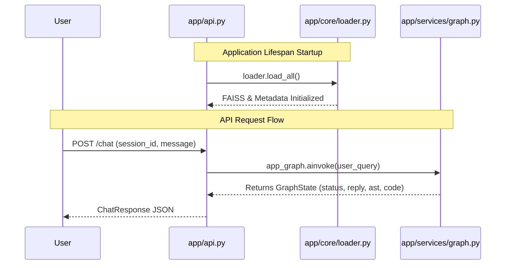

# `app/` Directory API Internals

This is the primary application directory for the **Nextflow AI Agent API** (`izs-llm`). It defines the FastAPI application endpoints and connects the server layer to the deeply nested LangGraph AI logic.

## Application Architecture

## Structure Overview

* **`api.py`**: The central FastAPI application. 
  * Uses a Python `@asynccontextmanager` called `lifespan` to preload the vector databases into memory upon Uvicorn boot.
  * Exposes the `POST /chat` endpoint. This routes incoming user text and their `session_id` into the LangGraph state machine (`app_graph`). Once the graph finishes traversing all of its active nodes, it returns the final `GraphState`, which the API packages into a `ChatResponse` model.
  * Includes a `GET /health` endpoint for basic readiness probes (useful for Docker orchestrators like Kubernetes).
* **`core/`**: Initialization loaders and application-wide configurations (like model selection and paths).
* **`models/`**: Strict Pydantic classes governing LLM output constraints.
* **`services/`**: The massive AI component. Contains the node definitions (Consultant, Architect, Diagram) and the actual StateGraph that links them.
* **`utils/`**: Utilities for rendering ASTs into Groovy strings using Jinja2 templates.
