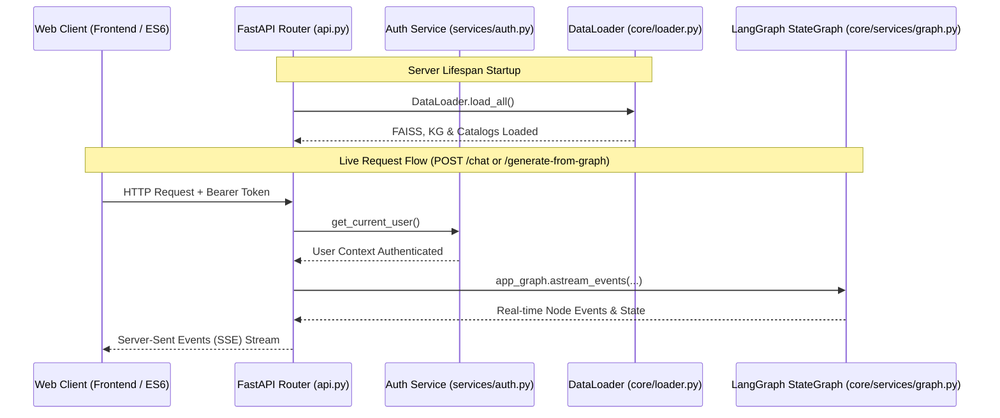

# Application Layer (`backend/app/`) - FastAPI Server, Routing & Session Management

The `backend/app/` directory encapsulates the HTTP server, REST endpoints, Server-Sent Events (SSE) streaming, authentication, database persistence, and rate limiting.

---

## 1. Application Layer Architecture


```mermaid
sequenceDiagram
    participant Client as Web Client (Frontend / ES6)
    participant API as FastAPI Router (api.py)
    participant Auth as Auth Service (services/auth.py)
    participant Core as DataLoader (core/loader.py)
    participant Graph as LangGraph StateGraph (core/services/graph.py)

    Note over API,Core: Server Lifespan Startup
    API->>Core: DataLoader.load_all()
    Core-->>API: FAISS, KG & Catalogs Loaded

    Note over Client,Graph: Live Request Flow (POST /chat or /generate-from-graph)
    Client->>API: HTTP Request + Bearer Token
    API->>Auth: get_current_user()
    Auth-->>API: User Context Authenticated
    API->>Graph: app_graph.astream_events(...)
    Graph-->>API: Real-time Node Events & State
    API-->>Client: Server-Sent Events (SSE) Stream
```

---

## 2. Directory Layout & Module Specifications

```
backend/app/
├── models/
│   ├── README.md                    Database schemas & auth request/response models
│   └── db_models.py                 SQLAlchemy models (User, Conversation, Drawing)
├── routes/
│   ├── auth.py                      JWT token creation (/auth/token) and registration
│   └── conversations.py             Conversation history listing, retrieval, and deletion
├── services/
│   ├── README.md                    Application-layer services specification
│   ├── auth.py                      Bcrypt password hashing & JWT token verification
│   └── rate_limit.py                Token-bucket rate limiter per IP / user
├── api.py                           FastAPI entrypoint, CORS, lifespan, /chat, /generate-from-graph
└── db.py                            SQLAlchemy SQLite engine and session factory
```

---

## 3. Key Endpoints

- **`POST /chat`**: Executes a conversational multi-turn turn through the Planner Subgraph (and Execution Subgraph upon user approval), streaming progress via SSE.
- **`POST /generate-from-graph`**: Accepts visual canvas Drawflow JSON (`{ components: [...], wires: [...] }`), triggers `drawer_enrich_node`, and directly generates Nextflow DSL2 code and Mermaid diagrams.
- **`GET /catalog/components`**: Returns the complete active plugin component dictionary with input/output channels and descriptions.
- **`GET /system-info`**: Real-time telemetry reporting LLM engine status, RAM/CPU load, vLLM prefix cache hit rate, and active plugin.
- **`GET /drawings` & `POST /drawings`**: Manages visual pipeline canvas states for the authenticated user.
