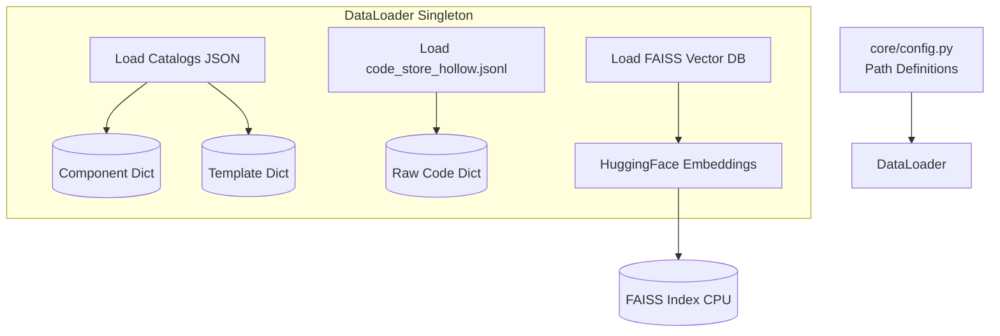

# `app/core/` Data Loaders

This module initializes the backend data connections before any API requests are served to the user. It dictates where the application looks for intelligence.

## Data Loading Flow

## Files & Capabilities

### `config.py`
A centralized `Settings` class ensuring there are no brittle hardcoded paths.
* Calculates `BASE_DIR` using relative Python module resolution.
* Defines the model configuration (e.g., `FAISS_INDEX_PATH`, `CODE_STORE`), explicitly utilizing `Qwen/Qwen3-Embedding-0.6B` for vector embeddings and routing requests to an inference model (like `labs-devstral-small-2512`).

### `loader.py`
Defines the `DataLoader` class, instantiated globally.
* **`_load_lookups`**: Sequentially opens `data/catalog/` components, templates, and resources, loading them into standard Python dictionaries. Importantly, if passed a LangGraph `BaseStore` (the in-memory state dictionary), it hydrates the store so the Agents can pull the metadata using `store.get(("components",), comp_id)` natively during graph traversal.
* **`_load_vector_store`**: Configures the `HuggingFaceEmbeddings` pipeline and hooks into `FAISS.load_local`. This is necessary to facilitate semantic similarity searches against user prompts (e.g., mapping "align viruses" to a specific tool).
