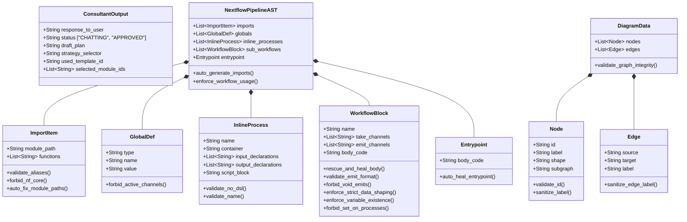

# `app/models/` Pydantic Guardrails

This directory contains strict **Pydantic Data Models**. It is the primary defense system against LLM hallucinations. Rather than asking an LLM to "write code", it forces the LLM to populate the objects below, allowing Python decorators to police the logic before it compiles.

## Comprehensive Data Model Architecture

The diagram below illustrates the hierarchical and interconnected nature of the Pydantic models across the architectural components (Architect, Consultant, and Diagram Generator).

## Defensive Modeling Files

### `ast_structure.py`
The most complex validation engine in the system. When the Architect Agent returns its pipeline suggestion, this file intercepts it and runs rigorous heuristic checks:
* **Validation Rules**: Uses `@field_validator` and `@model_validator` closures to parse the `body_code` using RegEx.
* **Self-Healing Triggers**: It detects if the LLM wrongly appends `.set` directly onto a process call (which is invalid in Groovy), or if it utilizes inline `.cross` statements without immediately flattening the tuple via `.map`. If it detects an error, it manually raises a `ValueError` injecting a highly-specific, scolding prompt instructing the LLM on exactly how to fix its own mistake.
* **Void Tool Blocking**: Specifically hardcodes rules preventing the LLM from trying to capture standard output channels from reporting/QC tools that utilize `publishDir` (Void tools). It forces deletion of hallucinated emit parameters.
* **Auto-Resolution Framework**: Automatically fixes common LLM mistakes, like deducing the exact import directory path (`../steps/`, `../modules/`, etc.) based entirely on the process prefix name.

### `consultant_structure.py`
Forces the Consultant Agent into its strict mode:
* Ensures `used_template_id` and `selected_module_ids` perfectly match strings retrieved from the RAG context.
* Restricts the agent to binary `status` decisions (`CHATTING` vs `APPROVED`).
* Requires the LLM to justify its pipeline strategy via `strategy_selector` (`EXACT_MATCH`, `ADAPTED_MATCH`, or `CUSTOM_BUILD`).

### `diagram_structure.py`
Maps Nextflow logic to Mermaid `.js` elements safely:
* Validates Graph `Node` and `Edge` schemas, catching duplicate IDs or strings that utilize reserved terminology that would crash the Mermaid runtime engine.
* Enforces `shape` typings mapping physical logic to visual markers (`input`, `process`, `operator`, `output`, `global`).
* Actively sanitizes labels to remove internal formatting quotes that break JavaScript rendering systems.
