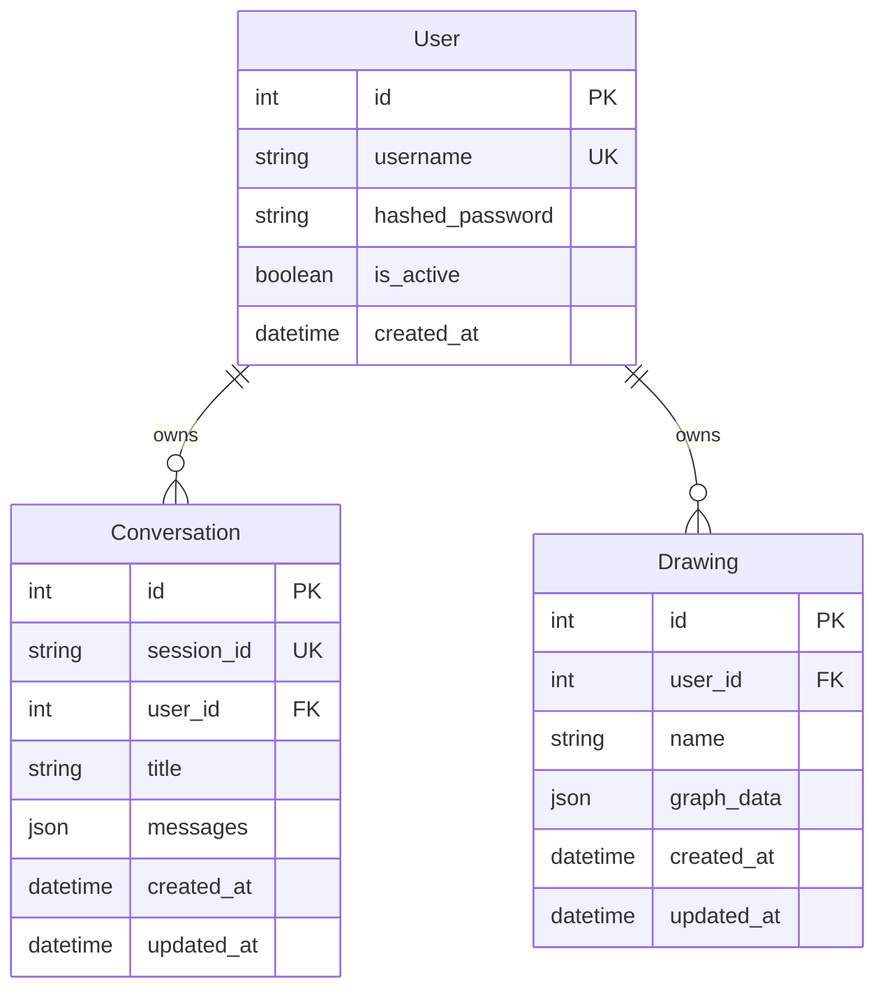

# Application Models (`backend/app/models/`) - Database Schemas & Session Persistence

The `backend/app/models/` directory defines the SQLAlchemy ORM models and Pydantic request/response schemas for database persistence.

---

## 1. Database Schema Model

```mermaid
erDiagram
    User ||--o{ Conversation : owns
    User ||--o{ Drawing : owns

    User {
        int id PK
        string username UK
        string hashed_password
        boolean is_active
        datetime created_at
    }

    Conversation {
        int id PK
        string session_id UK
        int user_id FK
        string title
        json messages
        datetime created_at
        datetime updated_at
    }

    Drawing {
        int id PK
        int user_id FK
        string name
        json graph_data
        datetime created_at
        datetime updated_at
    }
```

---

## 2. Models Specification (`db_models.py`)

### 2.1 `User`
Represents an authenticated platform user with secure bcrypt-hashed credentials.

### 2.2 `Conversation`
Persists conversational chat histories across sessions.
- `session_id`: Unique UUID representing the LangGraph thread ID.
- `messages`: Serialized list of chat messages for session restoration.
- `user_id`: Foreign key referencing the owning user.

### 2.3 `Drawing`
Persists visual pipeline designer states created in the `/drawer` canvas.
- `graph_data`: Serialized Drawflow JSON containing placed component blocks, coordinates, and port connections.
