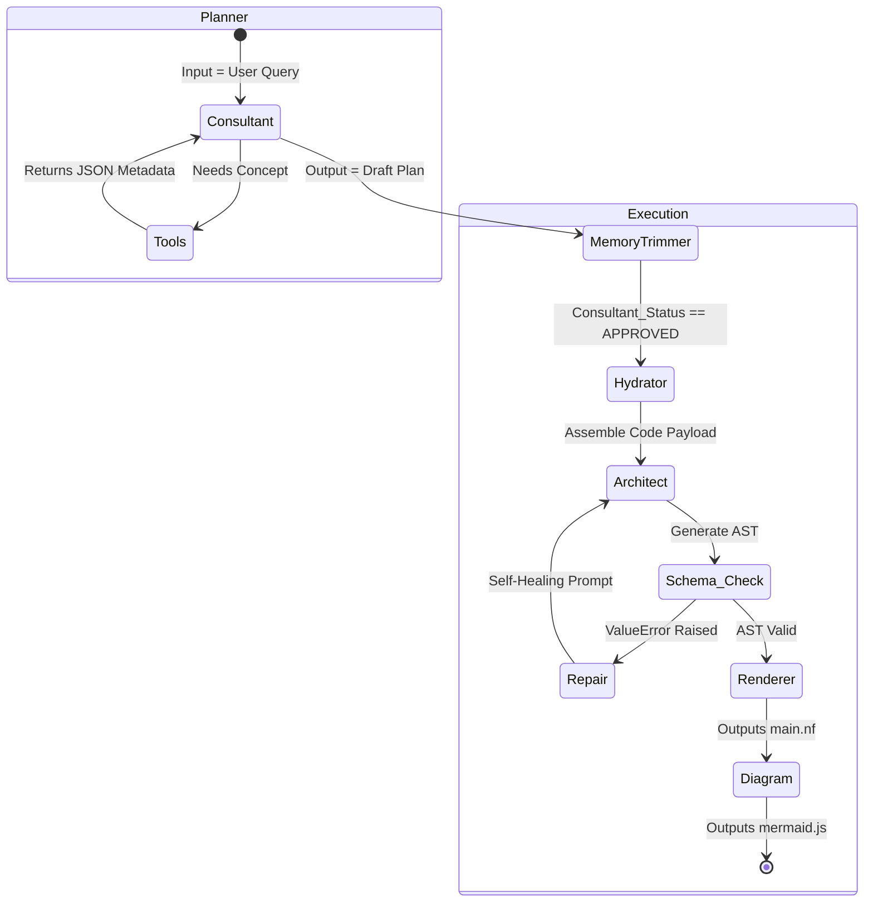
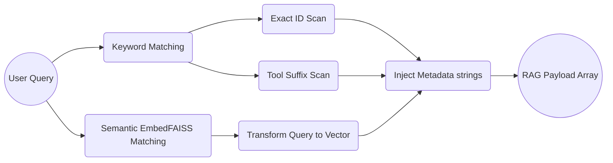

# `app/services/` Core Artificial Intelligence

The "Brains" of the application. This is where LangGraph orchestrates the various specialized agents to construct Nextflow pipelines. The agents communicate by modifying a shared state dictionary.

## Multi-Agent Logic Network

## System Implementation

### `graph.py` & `graph_state.py`
These files define the pipeline structure above.
* **`graph_state.py`**: Defines the massive `GraphState` typed dictionary holding conversation `messages`, `ast_json`, `mermaid_code`, `validation_error`, and more. Uses `Annotated[List[BaseMessage], add_messages]` to track conversation history.
* **`graph.py`**: Compiles the graph. Maps out the visual node workflow. Contains `build_consultant_subgraph()` (Planner Phase) and `build_execution_subgraph()` (Generation Phase), linking them conditionally based on the user's approval. Also implements the `delete_messages_node` to prune short-term conversation memory so the LLM doesn't hit a maximum context window limit.

### `agents.py`
Contains the immense System Prompts dictating the system's strict DSL2 behavior:
* **`consultant_node`**: Interrogates the vector store. Output is verified against hallucinated RAG module IDs.
* **`hydrator_node`**: An algorithmic parser (non-LLM). Modifies string interpolation. It evaluates the Consultant's `strategy_selector` (`EXACT_MATCH`, `ADAPTED_MATCH`, or `CUSTOM_BUILD`). For an adapted match, it runs a regex script (`filter_template_logic`) identifying lines of the source `.nf` template that don't match the new selected modules and comments them out `// [REMOVED BY PLAN]`.
* **`architect_node`**: The heavy-lifting Node. It processes the Hydrator's assembled context alongside the Consultant's manual. It utilizes `with_structured_output` to output the strict logic JSON.
* **`diagram_node`**: Receives the output `Nextflow` code from the Renderer, and compiles the text logic into a `DiagramData` mapping format for easy Mermaid generation.

### `tools.py`
Responsible for **Hybrid RAG Context Search**. 

### `repair.py`
The strict internal auto-healing feedback loop. If the `Architect Node` fails any constraint inside `ast_structure.py`, the `should_repair` condition intercepts it:
It wraps the Python error in the message `⚠️ CRITICAL: YOU ARE DRIFTING FROM THE SCHEMA... THE RULEBOOK... [ERROR MESSAGE]... GENERATE THE FULLY CORRECTED AST`. It will retry locally until solving it or failing entirely.

### `llm.py`
Factory pattern defining `get_llm()` to return the configured model instance (Groq, MistralAI, etc.).

### `renderer.py`
Takes the assembled logic and passes the JSON fields recursively into the `rendering.py` script. It cleans excess formatting whitespace and directly generates the raw file strings.
