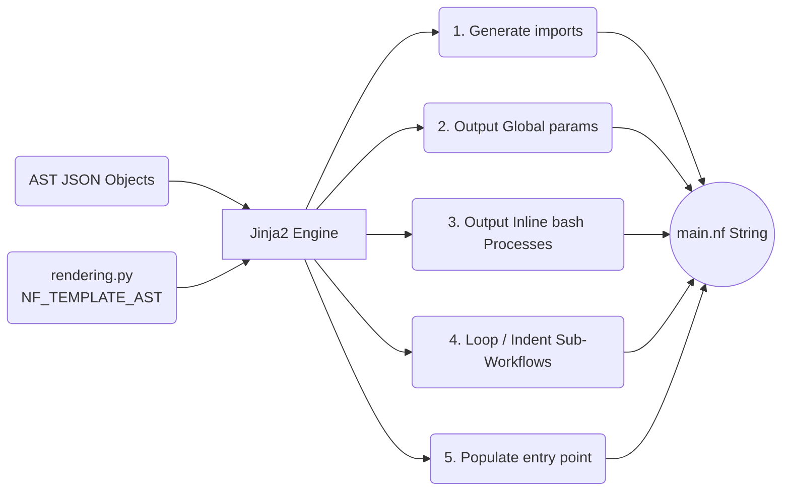

# `app/utils/` Templates

Contains purely algorithmic rendering engines to translate data arrays back into structural Groovy formatting.

## Process Layout

## Files

### `rendering.py`
* **`NF_TEMPLATE_AST`**: Defines a 100+ line Jinja2 templating block mapping the structural list outputs (e.g. `ast_json.imports`, `ast_json.globals`, `ast_json.sub_workflows`) into correctly formatted `.nf` modules. It carefully spaces code using standard DSL2 conventions.
