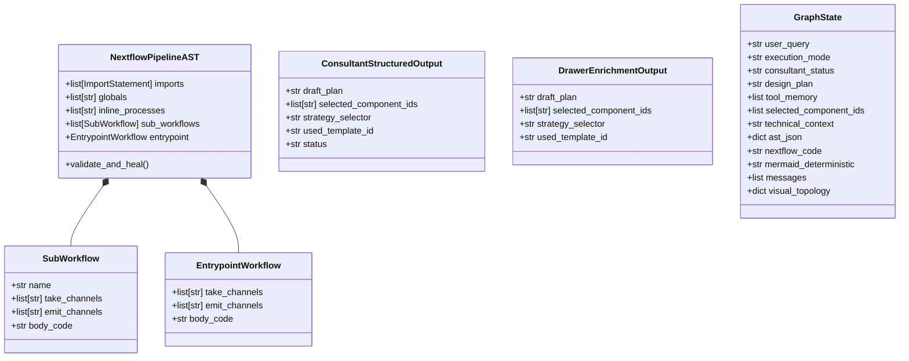

# Core Models (`backend/core/models/`) - Pydantic AST & Structured Data Models

The `backend/core/models/` package defines the strictly typed Pydantic models that govern LLM structured outputs, Abstract Syntax Tree validation, intent classification, and workflow state representation.

---

## 1. Pydantic Model Hierarchy

---

## 2. Model Specifications

### 2.1 Abstract Syntax Tree Models (`ast_structure.py`)
These schemas define the structural components of a Nextflow DSL2 script:
- **`NextflowPipelineAST`**: The top-level pipeline AST root object.
  - `imports`: List of `ImportStatement` or auto-resolved component imports.
  - `globals`: List of top-level Groovy variable definitions (e.g. `def paramA = '...'`).
  - `inline_processes`: Custom inline Nextflow DSL2 process definitions when needed.
  - `sub_workflows`: List of modular `SubWorkflow` definitions.
  - `entrypoint`: The main `workflow {}` block that instantiates input channels and invokes subworkflows.
- **`SubWorkflow`**:
  - `name`: Workflow identifier (e.g. `WF_DENOVO_ASSEMBLY`).
  - `take_channels`: Named inputs accepted by the subworkflow.
  - `emit_channels`: Named channels emitted from the subworkflow.
  - `body_code`: The inner process invocation and channel data-shaping body.
- **`EntrypointWorkflow`**:
  - `body_code`: Main entrypoint invocation logic.

---

### 2.2 Consultant & Drawer Enricher Structured Models (`consultant_structure.py`)
- **`ConsultantStructuredOutput`**:
  - `draft_plan`: Comprehensive textual architectural plan.
  - `selected_component_ids`: Verified list of catalog component IDs required for the pipeline.
  - `strategy_selector`: Strategy mode (`CUSTOM_BUILD`, `EXACT_MATCH`, `ADAPTED_MATCH`).
  - `used_template_id`: Template ID if adapting from an existing production template.
  - `status`: Conversational state (`CHATTING` or `APPROVED`).
- **`DrawerEnrichmentOutput`**:
  - Structured extraction schema for the Visual Canvas enricher. Output includes the enriched blueprint with explicit Nextflow DSL2 channel operators (`.cross()`, `.map{}`, `.multiMap{}`, `.combine()`, `param()`).
- **`PipelineIntentClassification`**:
  - Semantic classification schema determining input data level, workflow scope, requested technologies, and excluded tools without brittle regex rules.

---

### 2.3 Workflow State Schema (`services/graph_state.py`)
- **`GraphState`**: The TypedDict representing the global workflow state across LangGraph nodes.
  - `user_query`: Initial or current conversational prompt.
  - `execution_mode`: Execution mode (`interactive` or `direct`).
  - `consultant_status`: Planner status (`CHATTING` or `APPROVED`).
  - `design_plan`: High-level architectural plan.
  - `tool_memory`: Structured factual memory extracted by `compact_memory_node`.
  - `selected_component_ids`: List of verified component IDs.
  - `technical_context`: Assembled Groovy signatures and helper guidelines.
  - `ast_json`: Serialized `NextflowPipelineAST` object.
  - `nextflow_code`: Compiled Nextflow DSL2 source code string.
  - `mermaid_deterministic`: High-fidelity Mermaid flowchart string.
  - `messages`: LangGraph `add_messages` conversational trajectory.
  - `visual_topology`: Structured canvas dictionary `{ components, wires }` passed from `/drawer`.
