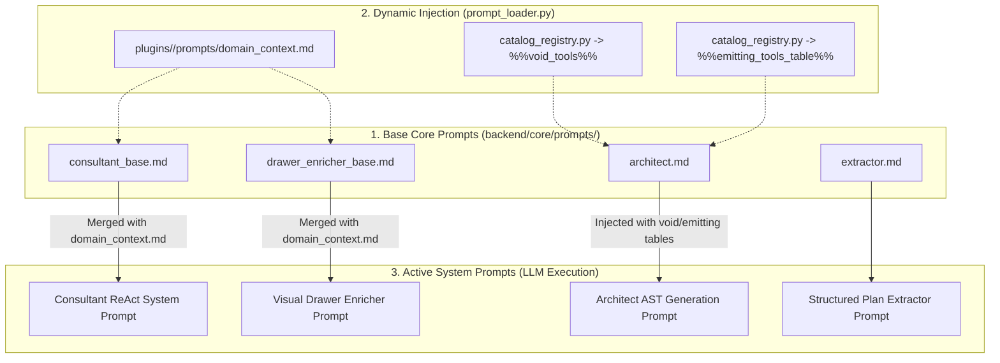

# Core Prompts (`backend/core/prompts/`) - Prompt Hierarchy & Dynamic Overlays

The `backend/core/prompts/` directory contains the base markdown templates that establish the cognitive personas, reasoning constraints, and output formats for all LangGraph agent nodes.

---

## 1. Dynamic Prompt Assembly Pipeline

Prompts in this directory are domain-agnostic templates. At boot time and during execution, `backend/core/services/prompt_loader.py` dynamically resolves the active plugin and injects domain-specific overlays and catalog metadata into template placeholders:

---

## 2. Core Prompt Template Specifications

### 2.1 `consultant_base.md` — ReAct Consultant Persona
Establishes the **Senior Bioinformatics Pipeline Consultant** persona for conversational chat turns.
- **Dynamic Tool Invocation**: Enforces that the LLM must search the Knowledge Graph (`query_knowledge_graph`) and catalog (`lookup_components_batch`, `search_components`) rather than relying on intrinsic hallucinations.
- **Lossless Compaction Awareness**: Directs the agent to formulate concrete reasoning facts so they are preserved in `tool_memory`.
- **Approval Intent Recognition**: Enforces explicit detection of user agreement (`APPROVED`) to transition seamlessly from planning into execution.

---

### 2.2 `drawer_enricher_base.md` — Visual Canvas Enricher Persona
Directs the LLM when synthesizing pipelines created on the Visual Canvas (`/drawer`).
- **Knowledge Graph Path Reflection**: Instructs the agent to evaluate the components and wires against `kg` dataflow paths.
- **Strict Nextflow DSL2 Channel Operator Synthesis**:
  - Injects `param('...')` references when components require additional parameter inputs.
  - Generates `.cross(extractKey(it))` or `.multiMap{}` before multi-input processes.
  - Enforces cohort aggregation `.collect()` or `.toList()` before multi-sample summary tools.
  - Injects `.map { ... }` closures to reconcile channel tuple arities.
  - References exact named emit channels (e.g. `process.out.depleted_reads`).

---

### 2.3 `architect.md` — Principal AST Architect Persona
Instructs the execution engine during `architect_generate_node`.
- **Strict Pydantic AST Schema**: Directs the LLM to output valid `NextflowPipelineAST` with `globals`, `inline_processes`, `sub_workflows`, and `entrypoint`.
- **Dynamic Void-Tool Constraint Enforcement**: Injects `%%void_tools%%` and `%%emitting_tools_table%%` to prevent assigning return values to void tools.
- **Clean Nextflow Idioms**: Forbids deprecated Nextflow syntax and enforces typed take/emit blocks.

---

### 2.4 `extractor.md` — Structured Plan Extractor
A focused extraction template used by `consultant_extract_node` to transform conversational chat dialogue into structured `ConsultantStructuredOutput` JSON without losing selected component IDs, strategy modes, or user directives.
