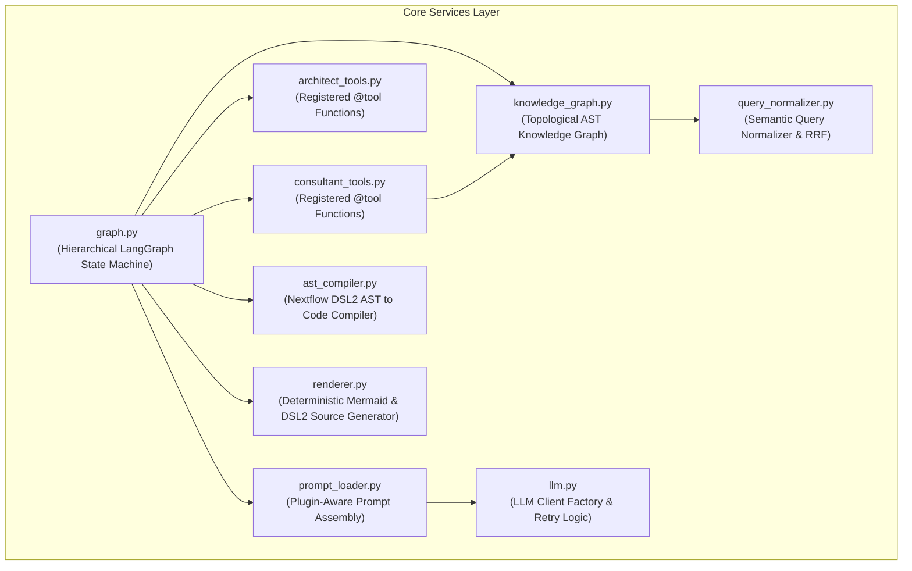

# Core Services (`backend/core/services/`) - Engine Modules & LangGraph Orchestration

The `backend/core/services/` directory contains the core algorithmic services, state graphs, compiler engines, and Knowledge Graph traversal tools that drive pipeline generation.

---

## 1. Subsystem Architecture & Service Map

---

## 2. Service Module Specifications

### 2.1 `graph.py` — Hierarchical LangGraph State Machine
Defines the `StateGraph` workflows and manages thread checkpoints using `InMemorySaver` and `InMemoryStore`.
- **`build_consultant_subgraph(store)`**:
  - **Dual Entry Point**:
    - If `state["visual_topology"]` is present $\rightarrow$ routes to `drawer_enrich_node`.
    - Otherwise $\rightarrow$ routes to `consultant_node` for conversational chat.
  - **ReAct Loop**: Calls `ToolNode(get_consultant_tools())` when tool calls are generated.
  - **Loop Circuit Breakers**:
    - Identifies silent repeating tool loops and automatically forces extraction.
    - Applies `MAX_TOOL_ITERATIONS` (5 for standard turns) and `MAX_TOOL_ITERATIONS_APPROVAL` (10 for approval turns).
  - **`sanitize_orphaned_tool_calls`**: Injects stub `ToolMessage` instances for unanswered tool calls when the iteration limit forces routing away from the tool node.
  - **`compact_memory_node`**: Performs lossless conversational compaction by extracting tool facts into structured `tool_memory` and removing raw intermediate tool message bloat.
- **`build_execution_subgraph(store)`**:
  - Linear deterministic pipeline: `architect_precheck_node` $\rightarrow$ `architect_generate_node` $\rightarrow$ `renderer_node`.
  - Zero repair loops — the Pydantic AST schema eliminates syntax compilation errors.
- **`build_graph()`**:
  - Combines the Planner and Execution subgraphs into a unified top-level workflow with conditional routing on `consultant_status == "APPROVED"`.

---

### 2.2 `knowledge_graph.py` — Graphify Topological Knowledge Graph
An AST-derived graph reasoning engine built on NetworkX representing the entire component catalog and verified dataflow connections.
- **3 Edge Confidence Tiers**:
  - `EXTRACTED`: Verified Nextflow AST wiring extracted from production pipelines (`source.out.channel | target`).
  - `INFERRED`: Co-occurrence extracted from production workflow templates.
  - `AMBIGUOUS`: Heuristic semantic match between channel names.
- **Traversals & Analytics**:
  - **`query_graph(question, mode, depth, token_budget)`**: Natural-language structural search supporting BFS (broad exploration) and DFS (linear chain tracing).
  - **`find_path_detailed(source, target)`**: Finds the shortest verified dataflow path between components, prioritizing `EXTRACTED` edges.
  - **`get_community(community_id)`**: Discovers modular functional clusters via Louvain community detection.
  - **`get_god_nodes(top_n)`**: Discovers central dataflow hub components.

---

### 2.3 `ast_compiler.py` — Deterministic Nextflow DSL2 Compiler
Converts a Pydantic `NextflowPipelineAST` object into clean, formatted Nextflow DSL2 source code.
- **`compile_ast_to_nextflow(ast)`**:
  1. Emits `nextflow.enable.dsl=2` header.
  2. Resolves imports for all used processes from `../steps/` and helper functions from `../functions/`.
  3. Synthesizes `globals` declarations and inline process blocks.
  4. Formats subworkflows with typed `take:`, `main:`, and `emit:` blocks.
  5. Formats the main `workflow {}` entrypoint with proper input instantiations (`getSingleInput()`, etc.).

---

### 2.4 `renderer.py` — Deterministic AST-to-Mermaid Flowchart Generator
Constructs high-fidelity Mermaid flowcharts directly from AST objects.
- **`render_mermaid_from_ast(ast_json)`**:
  - Renders subworkflow boundaries (`subgraph sg_<name>`), input ports (`in_<wf>_<channel>`), process vertices (`n_<wf>_<proc>_<idx>`), channel transformations, and output ports (`out_<wf>_<channel>`).
  - Completely eliminates phantom nodes, unassigned floating boxes, and duplicate process artifacts.

---

### 2.5 `consultant_tools.py` & `architect_tools.py` — LangGraph Tool Registries
Provides the registered `@tool` functions bound to the agent LLMs:
- **`search_components(query)`**: Fast hybrid search (Exact Keyword + FAISS semantic vector search with Reciprocal Rank Fusion) over catalog component descriptions and keywords.
- **`lookup_components_batch(item_ids, include_code)`**: Resolves metadata, take/emit channel signatures, and source code for multiple components in a single tool invocation.
- **`query_knowledge_graph(question, mode, depth)`**: Natural-language topological search and traversal over the structural Knowledge Graph.
- **`check_plan_logic(workflow_name, sub_workflows, component_sequence)`**: Static logical check validating dataflow compatibility, channel arity matching, and missing prerequisite steps.
- **`search_design_patterns(query)`**: Semantic retrieval of proven Nextflow DSL2 channel data-shaping patterns (`.cross()`, `.multiMap{}`, `.branch{}`, `.mix()`).
- **`search_helper_functions(query)`**: Finds built-in input parameter and data retrieval helper functions.

---

### 2.6 `prompt_loader.py` — Plugin-Aware Prompt Assembly
Assembles base prompt templates and merges domain-specific overlays dynamically.
- Merges `core/prompts/*.md` with active plugin overlays (`plugins/<name>/prompts/domain_context.md`).
- Populates template placeholders (`%%void_tools%%`, `%%emitting_tools_table%%`, `%%domain_context%%`) directly from `catalog_registry.py`.
- Employs LRU caching with `reload_prompts()` for zero-restart prompt experimentation.
