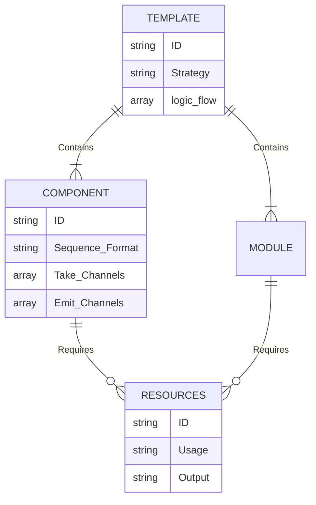

# `data/catalog/` Logic Definitions

A collection of JSON metadata files that map to physical lines of code inside `code_store_hollow.jsonl`. These represent what tools the system is inherently "aware" of.

## Relational Matrix Structure

## Specific System Definitions

### `catalog_part1_components.json`
* A massive structured JSON arrays containing individual `step_` logic modules (the core bioinformatics pipeline nodes).
* Teaches the Consultant Agent regarding what the tool's inputs and outputs are, keeping the AI from "wiring channels" backward or attempting to pipe unformatted sequences into arbitrary applications.

### `catalog_part2_templates.json`
* Contains larger overarching system pipelines (e.g. `module_..`).
* Used primarily through the `EXACT_MATCH` and `ADAPTED_MATCH` routing strategies. Let's say a user wants a generic assembly pipeline; the AI locates the matching `blueprint`, loads the exact `.nf` file from the data store, and outputs an identical, high-fidelity replica without hallucinating custom components.

### `catalog_part3_resources.json` 
* Stores standard data modification `functions`, providing the LLM with exact `usage` syntax commands so it can manipulate arrays smoothly without causing runtime exceptions.
