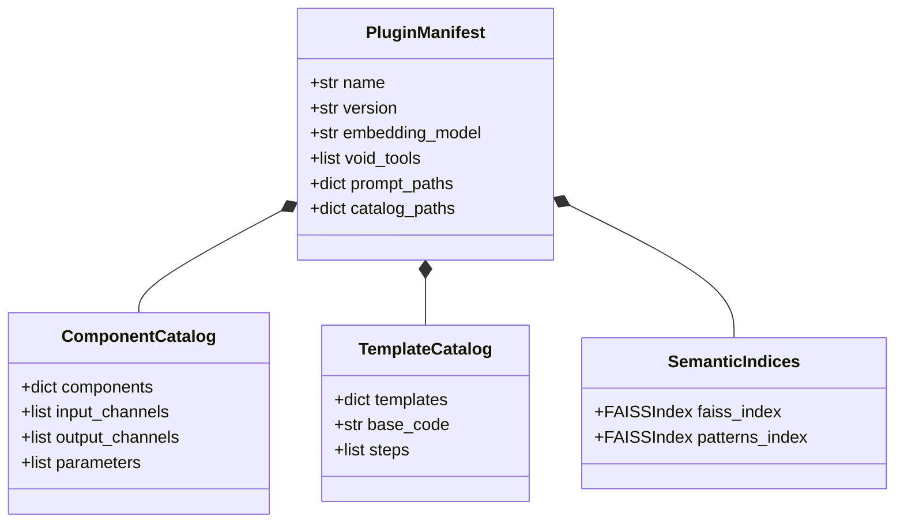

# Plugin System (`backend/plugins/`) - Dynamic Domain Registries & Catalogs

The `backend/plugins/` directory houses self-contained, modular domain plugins. Each plugin provides the domain knowledge, component catalog, workflow templates, vector indices, and prompt overlays required by the domain-agnostic core engine.

---

## 1. Plugin Architecture & Separation of Concerns



---

## 2. Standard Plugin Directory Specification

Every plugin directory must conform to the standard layout:

```
plugins/<plugin_name>/
├── plugin.yaml                      Master plugin manifest and metadata
├── catalog/
│   ├── components.json              Component registry with input/output channels and descriptions
│   ├── templates.json               Production workflow templates and steps
│   └── resources.json               Helper functions, parameter definitions, and container images
├── faiss_index/                     Pre-computed FAISS vector index of component documentation
├── patterns_index/                  Pre-computed FAISS vector index of Nextflow DSL2 channel patterns
├── prompts/
│   └── domain_context.md            Domain-specific guidelines merged into core prompts
├── code_store.jsonl                 Verbatim Nextflow source code for each component
└── benchmark_data/                  Evaluation datasets (L1-L5) for continuous benchmarking
```

---

## 3. How to Create a New Plugin

1. Create directory `backend/plugins/<new_plugin_name>/`.
2. Author `plugin.yaml` specifying `name`, `version`, `embedding_model`, and `void_tools`.
3. Ingest your DSL2 processes into `catalog/components.json` and `code_store.jsonl`.
4. Generate the FAISS vector indices using the ingestion embedding CLI.
5. Set `ACTIVE_PLUGIN=<new_plugin_name>` in `.env`.
